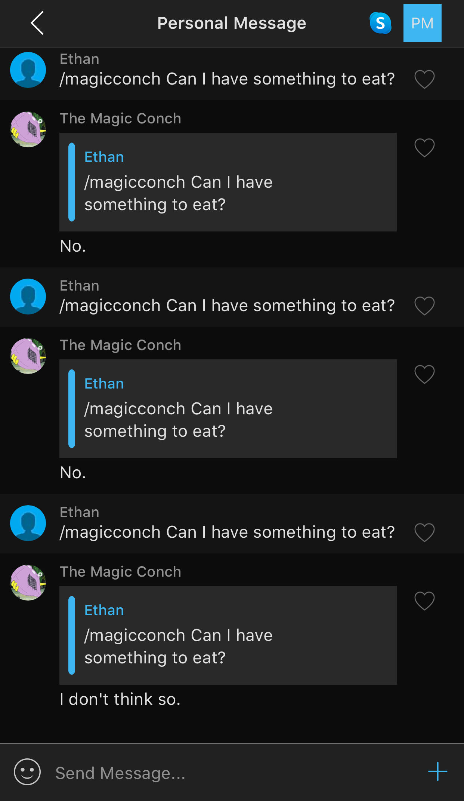
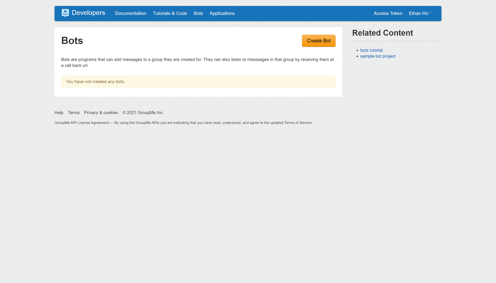
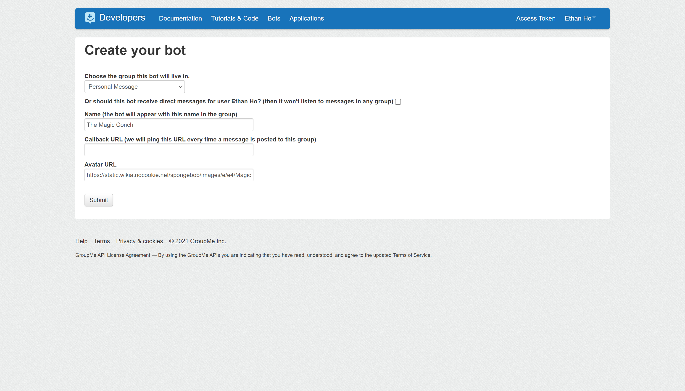
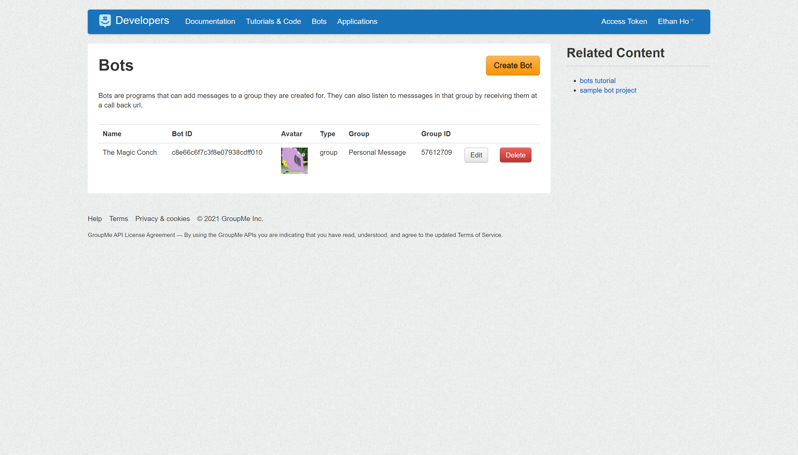
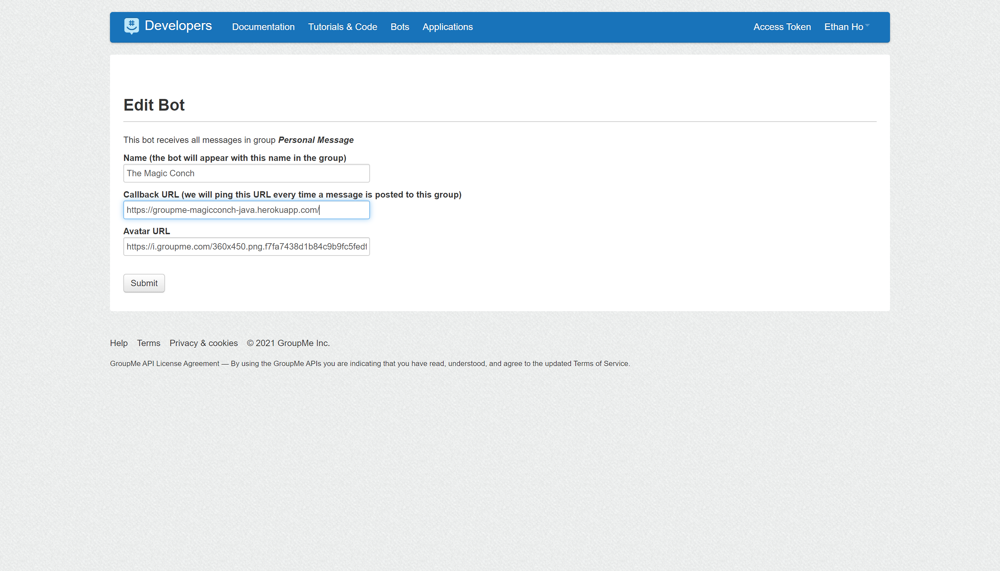

# Magic Conch Bot
## Python Edition

This repository contains code for deploying a GroupMe bot that responds to
messages prefixed with the text `/magicconch`. The bot can respond with the
following replies:

* Maybe someday.
* Nothing.
* Neither.
* I don't think so.
* Yes.
* No.
* Try asking again.



## Deployment Instructions

### Overview

There are two main technologies driving your GroupMe bot: GroupMe and Heroku.
GroupMe supports "bots" which can listen to and send messages. However, simply
setting up a bot on GroupMe does not make it functional. We also need to deploy
some web service (e.g., on a cloud-hosted server) that can process incoming
group messages and send out message responses accordingly. To give the bot
functionality, we use Heroku, a cloud application platform. We will deploy a
Heroku app that will listen to messages coming in from a desired group and send messages accordingly.

### Prerequisites

Before beginning, make sure you have the following:

* A [Heroku](https://www.heroku.com/home) account
* A [GroupMe](https://groupme.com/) account
* [Git](https://git-scm.com/downloads) for the command line installed
* The [Heroku Command Line Interface (CLI)](https://devcenter.heroku.com/articles/heroku-cli) installed

### Create a GroupMe Bot

First, we need to create a GroupMe bot. The process is fairly straightforward,
as GroupMe provides a simple form where you fill in basic group and name
information. You will need to make note of the Bot ID associated with the bot
you create, as it will be used in the Heroku app.

1. Go to: https://dev.groupme.com/
1. Click "Log In" and sign in with your credentials
1. After logging in, click the "Bots" link
1. Click the "Create Bot" button

1. On the "Create your bot" page, do the following:
   1. Choose the group you want the bot in (cannot be changed later)
   1. Name the bot (can be changed later)
   1. Leave the callback URL blank for now
   1. Enter the URL for a bot avatar icon (optional, can be changed later)
   1. Click the "Submit" button

1. **Make note of the new Bot Name and Bot ID since they will be used later**


### Create and Deploy Your Heroku App

Next, we create the Heroku app and deploy our code. After that, we tell the
GroupMe bot to use our Heroku app to process group messages.

1. Open up command prompt/Git Bash/terminal
1. Clone this repository: `git clone https://github.com/stuejho/groupme-magicconch-python`
1. Move into the cloned directory by executing `cd groupme-magicconch-python`
1. Create a Heroku app: `heroku apps:create groupme-magicconch-python`
1. Add a Heroku remote using the Heroku app name from earlier: `heroku git:remote -a YOUR-APP-NAME`
1. Set your `GROUPME_BOT_ID` as a config (environment) variable: `heroku config:set GROUPME_BOT_ID=YOUR-BOT-ID`
1. Set your `GROUPME_BOT_NAME` as a config (environment) variable: `heroku config:set GROUPME_BOT_NAME=YOUR-BOT-NAME`
1. Deploy the app by pushing it to the `heroku` remote: `git push heroku master`
1. Once the app is finished deploying, you should see a deployment URL. It
   should be in the form `https://YOUR-APP-NAME.herokuapp.com/` (e.g., 
   `https://groupme-magicconch-python.herokuapp.com/`). If you do not see the 
   URL, try executing `heroku info` and make note of the "Web URL". **Make note 
   of the new Web URL since it will be used later**

Example:

```console
$ git clone https://github.com/stuejho/groupme-magicconch-python
$ cd groupme-magicconch-python
$ heroku apps:create groupme-magicconch-python
$ heroku git:remote -a groupme-magicconch-python
$ heroku config:set GROUPME_BOT_ID=c4d0e0d9985e49a7096a3afbd2
$ git push heroku master
```

### Set the Bot Callback URL

1. Return to the [GroupMe Bots](https://dev.groupme.com/) site and click "Edit"
   for your bot
1. Paste in the Web URL from earlier into the "Callback URL" field

1. Click "Submit" to save the changes
1. Try sending `/magicconch Can I have something to eat?` in your GroupMe group and
   see if it works